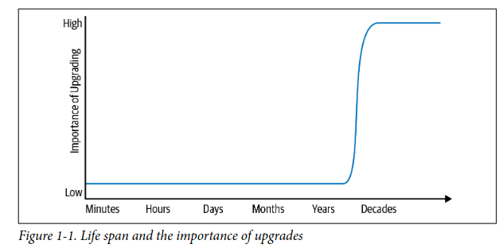
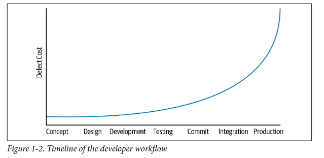

* *==The presentation for this chapter is found [here](https://prezi.com/p/edit/jls_i-p8noyx/)==* 
* Critical differences between programming and software engineering:  
	1. Time
		* software engineers need to be more concerned with time and the eventual need for change.
	2. Scale
		* software engineering organizations needs to be more concerned with scale and efficiency for both the software they produce as well as for the organization that producing it.
	3. Trade-off
		* software engineers are asked to make more complex decisions based on imprecise estimates of the time and growth.

-> **Time**

* ''software engineering is programming integrated over time.'' -> programming is an important part of software engineering but software engineering in not programming. software engineering is more about development, modification and maintence but programming is about development only. So, **time adds an important dimension to the programming**.
	
* "What is the excpected life span of your code"?
		* life span of code -> means how long the code will be executed, built and maintained? how long this software will provide a value? 
	
	* This question gives you the impact of time on a program and show the difference between the short lived programs and long lived programs. As the short lived programs are just a programming problems that unlikely needs to adapt the changes or upgrades.
	
- **Sustainable Software** -> your project is sustainable if for its expected life span, you are capable of reacting to whatever **valuable** change comes along either for technical or business reasons.

-> **Scale**

* Considering scale in software engineering is to see how many people are involved? 
* A programming task is often an act of individual creation, but a software engineering  
task is a team effort.
* definition to software engineering -> "The multiperson development of multiversion programs."
	* multiperson -> people and team
	* multiversion -> time and changes
* problems like team organization, project composition and policies of a software projects scale as the grows and expand its project

-> **Trade-off**
*  software engineering is different from programming in terms of the complexity of decisions that need to be made.
* In software engineering, we aim to sustainability and the management of the scaling costs for the organization.

## Time and Change

* short lived projects like programming assignments or startup development **vs**
long lived projects (unbounded life span projects) like a Google search and Apache HTTP server

* 

### Hyrum's law
"With a sufficient number of users of an API, it does not matter what you promise in  
the contract: all observable behaviors of your system will be depended on by  
somebody"

* discussions of change and maintenance over time must be aware of Hyrum’s Law.
* ust because Hyrum’s Law will apply when maintaining software doesn’t mean we can’t plan for it or try to better understand it. We can mitigate it, but we know that it can never be eradicated.

### Why not just aim for "Nothing changes"?

* Every piece of technology upon which your project depends has some (hopefully small) risk of containing critical bugs and security vulnerabilities that might come to light only after you’ve started relying on it.
* Efficiency improvements further complicate the picture. We want to outfit our data‐  
   centers with cost-effective computing equipment. Over time, the value in upgrading to newer hardware can be diminished without accompanying design changes to the software.
* Backward compatibility ensures that older systems still function.
* There are large risks for long-term projects that haven’t invested in sustainability. we shouldn’t change just for the sake of change. But we do need to be capable of change.

## Scale and Efficiency

* Much of this book focuses on the complexity of scale of the organization and the processes that we use to keep that program running over time.
* "Your organization's codebase is sustainable when you are able to change all of the things that ought to change, safely, and can do so for the life of your codebase"
* Just as software itself needs to scale well with traditional resources such as compute, memory, storage, and bandwidth the development of that software also needs to scale, both in terms of human time involvement and the compute resources that power your development workflow.
* Everything your organization relies upon to produce and maintain code should be scalable in terms of overall cost and resource consumption. In particular, everything your organization must do repeatedly should be scalable in terms of human effort.

### policies that don't scale well

* With a little practice, it becomes easier to spot policies with bad scaling properties. Most commonly, these can be idenified by considering the work imposed on a single engineer and imagining the organization scaling up by 10 or 100 times.
* A dedicated group of experts execute the change scales better than asking for maintence effort from every user. experts spend some time learning the whole problem in depth and then apply that expertise to every subproblem.
* example -> traditional use of development branches

### policies that scale well

* Expertise and shared communication forums offer great value as an organization scales. As engineers discuss and answer questions in shared forums, knowledge tends to spread and new expertise grow.

**Factors that affect the flexibility of a codebase**:
1. Expertise -> we know how to do this
2. Stability -> there is less change between releases because we adopt releases more regularly.
3. Conformity -> here is less code that hasn’t been through an upgrade already.
4. Familiarity -> we can spot redundancies in the process of performing an upgrade and attempt to automate. because we make the upgrade regularly.
5. Policy

### Shifting Left
* finding problems earlier in the developer workflow usually reduces costs
- **Shifting problem detection to the “left” earlier on this timeline makes it cheaper to fix than waiting longer**
- 

## Trade-offs and Costs

* If we understand how to program, understand the lifetime of the software we’re
  maintaining, and understand how to maintain it as we scale up with more engineers
  producing and maintaining new features, all that is left is to make good decisions.

* The idea that there needs to be a reason for everything. There is no place for “because I said so,” or “because everyone else does it this way”. we should be able to explain our work when deciding between the general costs for two engineering options.

* Cost can involve any or all of these factors:
	1. Financial cost (money)
	2. Resource cost (CPU time)
	3. Personnel cost (engineering effort)
	4. Transaction cost (what does it cost to take action?)
	5. Opportunity costs (what does it costs to not take actions?)
	6. Societal costs (e.g., what impact will this choice have on society at large?)

* The health of an organization isn’t just whether there is money in the bank, it’s also whether its members are feeling valued and productive. In highly creative and lucrative fields like software engineering, financial cost is usually not the limiting factor but personnel cost usually is. Efficiency gains from keeping engineers happy, focused, and engaged.

### Inputs to Decision Making
* When we are weighing data, we find two common scenarios:
1. All of the quantities involved are measurable or can at least be estimated
2. we don’t know how to measure them. ---> Here, there is no easy answer, we rely on experience and leadership and research

* “If I spend two weeks changing this linked-list into a higher-performance  
structure, I’m going to use five gibibytes more production RAM but save two thou‐  
sand CPUs. Should I do it?” Not only does this question depend upon the relative  
cost of RAM and CPUs, but also on personnel costs (two weeks of support for a soft‐  
ware engineer) and opportunity costs (what else could that engineer produce in two  
weeks?

### Revisiting Decision, Making Mistakes
* for a long-lived organization, time doesn’t only trigger changes in technical dependencies and software systems, but in data used to drive decisions.
* We believe strongly in data informing decisions, but we recognize that the data will  change over time, and new data may present itself. This means, inherently, that decisions will need to be revisited from time to time over the life span of the system.
* For long-lived projects, it’s often critical to have the ability to change directions after an initial decision is made. And, importantly, it means that the deciders need to have the right to admit mistakes.

## Software engineering VS Programming
**Programming** ---> Programming is the immediate act of producing code.
**Software engineering** ---> is the set of policies, practices, and tools that are necessary to make that code useful for as long as it needs to be used and allowing collaboration across a  
team.
